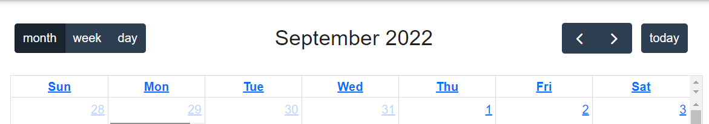
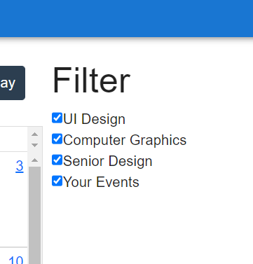
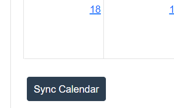
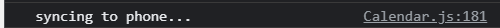
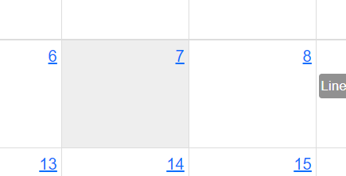
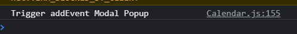
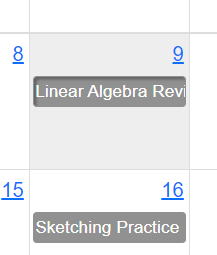

# Calendar Details
## Overview
The calendar in our UI is very similar to the calendar used in Canvas. It does not, in fact, have different features so much as it strives to make the most important features more obvious. The goal was to allow students to use the calendar not only to view upcoming assignments, but to be able to add and edit their own events. Full implementation of this was not achieved at this time but will be noted with each feature description.

## Features

#### Title Bar

The title bar of the calendar announces the current time frame the user is looking at and allows them to switch between month, week, and day views. The arrows in the top right can be used to navigate to the previous or next month, week, or day depending on the selected view mode. The today button brings the user back to the current month, week, or day. The current date in this UI is hard-coded for October 15th.

#### Filter

The filter menu on the right toggles which classes the user is viewing. Unchecking the box for a specific class removes all assignments from that class from view. The intent was to carry this out with personally added events as well but that feature is not working in full at this time. Re-checking the box is meant to bring the assignments for that class back. At the moment, this is not in the code exactly and re-checking any box will simply reset the view to it's original state with all assignments shown. 

#### Sync

While it is not currently functioning (clicking the button simply prints a statement into the console log), this button is meant to give students the option to sync their Canvas calendar to their phone. This is a feature Canvas currently has but it is presented in a very abstract way that is hard to locate. This button is much more obvious and easy to use.

#### Add Event

This is, unfortunately, another feature that is not functioning. The intent was to allow students to add custom events to the page by clicking on any day. This function is available in the same way in Canvas but gives no feedback to the user to show that clicking a particular day will do anything. In this UI, the box is grayed out to indicate selectability. Clicking a day at this time will simply print a message to the console log.

#### Go to Course

There is a hover shadow on each event in the calendar to indicate that they are clickable as well. Clicking an event will bring you to the course page. Ideally, it would bring you to the exact assignment it displays.

