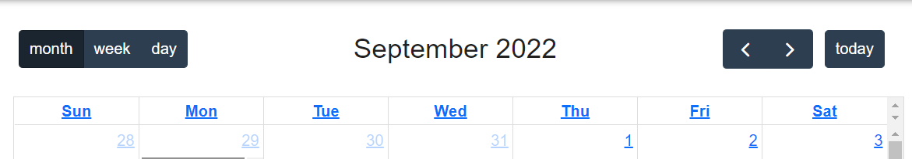
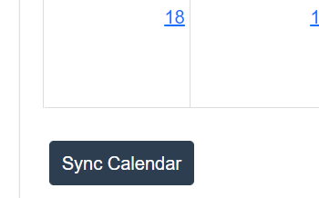

# Notifications Details
## Overview
Notifications are a vital part in informing a student/user about a whole host of things on canvas. Each notificaion type below has a testing feature to show how the user will be able to see when a notification was pushed. This system has the major flaw in not having a backend server, but the proof of concept here is enough to get the point across.

## Features

#### Notifications Page

The page itself is nothing special, with a bunch of notifications running down the left side that corrispond to various types of notifications that the user could recieve from classes. More on the types of noticications, ahead.

#### Informational Notifications

Notifications that are Blue, are notification messages. These are used to relay information from the user that usually has not good or bad meaning behind them. The color blue was chosen to be neutral, with little emotion behind it. There are three types of iformation notifications, one for each class.

#### Graded Notifications

Graded notifications are green to indicate success and give the user a feeling of accomplishment. Even if the student only partially succeeded on an assignment, it was worth while to keep the notification green, in order to try and reward them for getting an assigment in.

#### Missing Notifications

Essentially the opposite of the Graded Notifications, if a student gets a Missing Notification, they user will know something wrong happend with their submission. Mising Notifications are yellow, to not reward the user yet, and also relay that something is wrong with their grade.

#### Non-implemented features

Unfortunately, this system doesn't really work as a true notification system. A LOT of effort was put into making a server on the backend run a notifcation sender to get this working without a test button, but that was not meant to be. Everything else about this system works how we generally want it.

#### Wrap up

The entire goal of the notifications page was to have a place for notifications to appear so that the user could be reminded of anything they need to know in the moment, in case they missed the notification in the top right. This page is able to do that, and we have shown proof of concept in getting notificaitons pushed to the screen. A color system was implemented to reward the user for their work, and other colors were used to fully encompass all the notifcation types that could potentially be pushed to the user.
