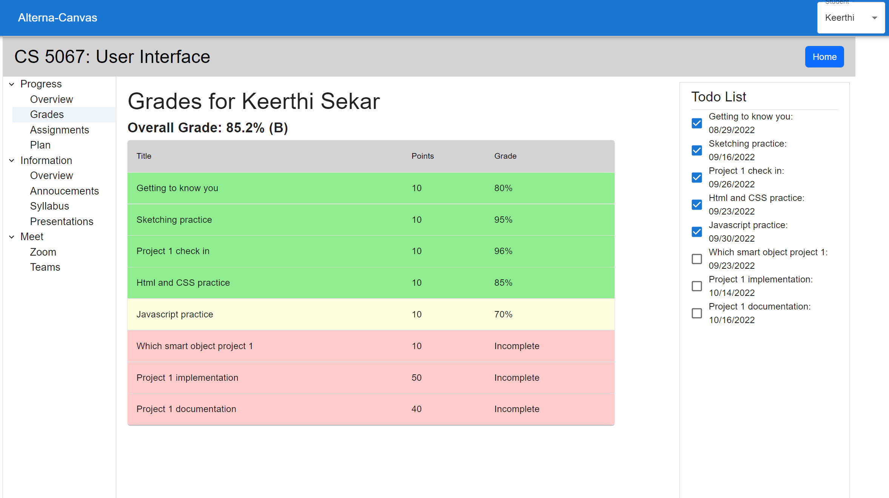

# Course Interface Details
## Overview
The main content of our application exisits within the individual course pages. The user reaches the course page by clicking on the button associated with the class they want to explore on the home page, then clicking the view full course button. The default view of the course page shows the users progress. Two features are always shown on the home page. One is the tree menu that shows the additional pages the user can go to organized by catagory. The second is the todo list that shows the user what they need to do and what has been done. Within the course page the user can see their grades, assignements, plan, course info, annoucements, syllabus and presentations. They also can find links to Zoom and Teams. We will go into the features on these pages more in the Features and Controls section.

## Features and Controls

The default page for each course shows the users progress in the course. The two main features on this page are the percentage completed graph and the hours worked graph. The purpose of these features is to show the student how much they have done and how much they have left to do. The progress page is dynamic and changes per student.
 
 

The next page on the course component shows the students their grades. This view highlights the assignments with three different colors to display the grade range .
 
 

The assignment page shows the assignments associated with class. When you click on the assignment it takes you to the assignment details page. Once on the details page the user can click on the submit button and are taken to the submission page. On the submission page the user can add a text entry or upload a file. The application gives alerts as placeholders for where the real upload and submission would take place.
 
 

The plan page allows for more organization and motivation for the student. The student can enter a title for a new plan and a list of tasks for the plan and start and end dates. The interface will show all plans created by the student and progress towards them. It will also show if they are behind or on track for each task.
 
 

The annoucent page shows a list of annoucements made by the professor chronological order.
 
 

There is a dedicated syllabus page under the information header that displays each course syllabus.
 
 

Presentation Download feature show all of the course presentations. When clicked an alert pops up as a placeholder for downloading.
 
 

The zoom page consists of a link that will take the user to the zoom webpage.
