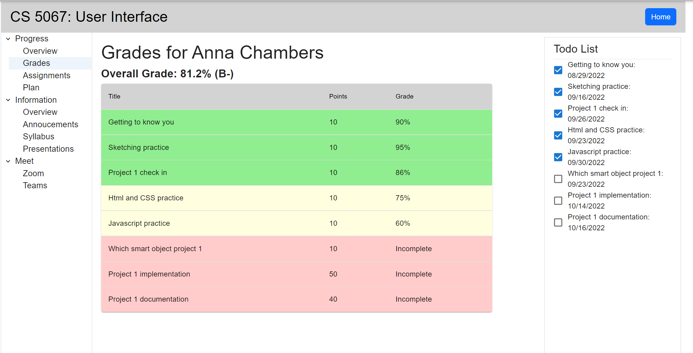

# Course Interface Details
## Overview
The main content of our application exisits within the individual course pages. The user reaches the course page by clicking on the button associated with the class they want to explore on the home page, then clicking the view full course button. The default view of the course page shows the users progress. Two features are always shown on the home page. One is the tree menu that shows the additional pages the user can go to organized by catagory. The second is the todo list that shows the user what they need to do and what has been done. Within the course page the user can see their grades, assignements, plan, course info, annoucements, syllabus and presentations. They also can find links to Zoom and Teams. We will go into the features on these pages more in the Features and Controls section.

## Features and Controls

Overall features (dynamic per class and per student)  
Progress features (chart 1 = amount of work done on active assignments. chart 2 = hours worked on this class this week)
 
 

Grade features (changes per student, color coded by grade level)
 
 

Assignment features (clickable to take to assignment description. Submit button takes to submission page with text entryand file upload. Alerts to mock uploading a file and submitting)
 
 

Plan Features (user makes a plan and lisk of plans is shown and progress towards plan is updated as they check tasks off)
 
 

Annoucements feature
 
 

Syllabus feature
 
 

Presentation Download feature
 
 

Zoom feature (links to zoom webpage)
